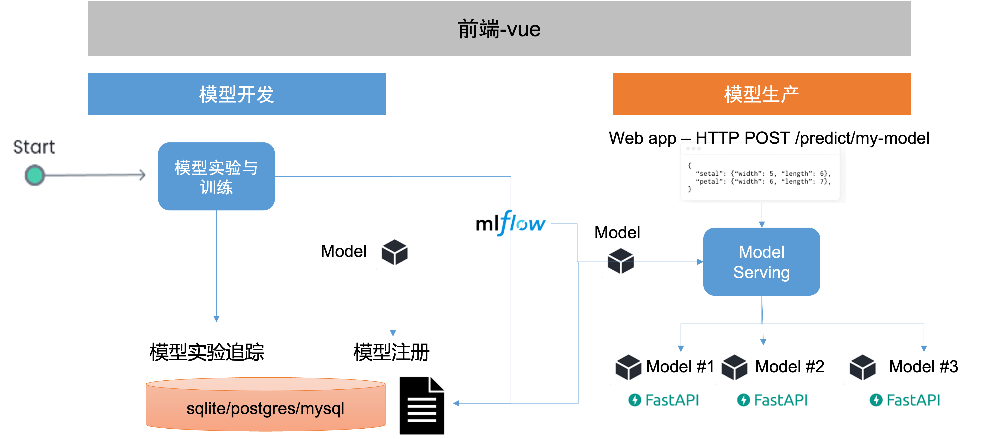

<h1 align="center"> mlopskit </h1>
<p align="center">
  <em>用于生产 MLOps 的Python简易框架。</em>
</p>

---

<p align="center">
  <a href="https://github.com/leepand/open-mlops"></a>
       <a href="https://github.com/leepand/open-mlops"></a>     
   <a href="https://github.com/leepand/open-mlops"></a>   
   <a href="https://github.com/leepand/open-mlops"></a>   
   
</p>

从0-1的 MLOps 项目，适应于中小型企业的 MLOps 实践参考。

## 快速开始

安装invoke:

```
pip install invoke
```

然后运行:

```
invoke buildAndServe
```

## 技术架构



## 相关资源
* [MLOps-机器学习从开发到生产](https://github.com/leepand/MLOps-practice)<br/>
